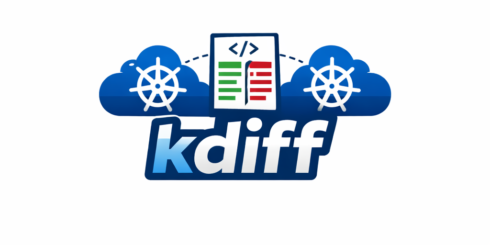

<div align="center">
  
</div>

# kdiff - Docker Guide

Compare Kubernetes resources between clusters using Docker.

## Features

- Intelligent diff detection - normalizes and compares Kubernetes resources
- Interactive HTML reports - detailed reports with color-coded diffs
- Side-by-side diff viewer - dual-pane comparison with synchronized scrolling
- Enhanced UI cards - interactive resource cards with improved hover effects
- Resource filtering - compare specific namespaces and resource types
- Fast and lightweight - Alpine-based image (~182MB)
- Secure - runs as non-root user

## Quick Start

### Using Docker

```bash
docker run --rm -it \
  --pull always \
  -v ~/.kube/config:/home/kdiff/.kube/config:ro \
  -v $(pwd)/kdiff_output:/app/kdiff_output \
  mabombo/kdiff:latest \
  -c1 prod-cluster -c2 staging-cluster -n myapp
```

### Using the Wrapper Script

For easier usage, download and use the `kdiff-docker` wrapper script:

```bash
# Make it executable
chmod +x kdiff-docker

# Run kdiff
./kdiff-docker -c1 prod-cluster -c2 staging-cluster -n myapp
```

## Usage Examples

### Compare entire namespaces
```bash
docker run --rm -it \
  --pull always \
  -v ~/.kube/config:/home/kdiff/.kube/config:ro \
  -v $(pwd)/kdiff_output:/app/kdiff_output \
  mabombo/kdiff:latest \
  -c1 production -c2 staging -n myapp
```

### Compare specific resource types
```bash
docker run --rm -it \
  --pull always \
  -v ~/.kube/config:/home/kdiff/.kube/config:ro \
  -v $(pwd)/kdiff_output:/app/kdiff_output \
  mabombo/kdiff:latest \
  -c1 prod -c2 staging -n myapp \
  --include-resource-types deployment,configmap
```

### Include services and ingress resources
```bash
docker run --rm -it \
  --pull always \
  -v ~/.kube/config:/home/kdiff/.kube/config:ro \
  -v $(pwd)/kdiff_output:/app/kdiff_output \
  mabombo/kdiff:latest \
  -c1 prod -c2 staging -n myapp \
  --include-services-ingress
```

### Show full metadata in diffs
```bash
docker run --rm -it \
  --pull always \
  -v ~/.kube/config:/home/kdiff/.kube/config:ro \
  -v $(pwd)/kdiff_output:/app/kdiff_output \
  mabombo/kdiff:latest \
  -c1 prod -c2 staging -n myapp \
  --show-metadata
```

## Configuration

### Volume Mounts

- **kubeconfig**: Mount your kubeconfig file to `/home/kdiff/.kube/config:ro` (read-only)
- **Output**: Mount a local directory to `/app/kdiff_output` to persist reports

### Environment Variables

- `KUBECONFIG`: Path to kubeconfig file inside container (default: `/home/kdiff/.kube/config`)
- `PYTHONUNBUFFERED=1`: Ensures real-time output

## Command-Line Options

```
usage: kdiff [-h] -c1 C1 -c2 C2 [-r R] [-n N] [-o O] [-f FORMAT]
             [--include-volatile] [--include-services-ingress]
             [--include-resource-types TYPES] [--exclude-resources RESOURCES]
             [--show-metadata]

Required arguments:
  -c1 C1                First Kubernetes context
  -c2 C2                Second Kubernetes context

Optional arguments:
  -n N                  Namespace to compare
  -r R                  Resource type to compare
  -o O                  Output directory (default: kdiff_output)
  -f FORMAT             Output format: html, json, md (default: html)
  --include-volatile    Include volatile fields in comparison
  --include-services-ingress
                        Include service and ingress resources
  --include-resource-types TYPES
                        Comma-separated list of resource types
  --exclude-resources RESOURCES
                        Comma-separated list of resources to exclude
  --show-metadata       Show full metadata in diffs
```

## Output

Reports are generated in `/app/kdiff_output/latest/`:

- `diff-details.html` - Interactive HTML report with visualizations
- `summary.json` - JSON summary of all differences
- `diff-details.json` - Detailed JSON of all diffs
- `diffs/` - Individual diff files per resource

## Building from Source

```bash
# Clone the repository
git clone https://github.com/mabombo/kdiff.git
cd kdiff

# Build the Docker image
docker build -t kdiff:latest .

# Run
docker run --rm -it \
  -v ~/.kube/config:/home/kdiff/.kube/config:ro \
  -v $(pwd)/kdiff_output:/app/kdiff_output \
  kdiff:latest -c1 context1 -c2 context2 -n namespace
```

## Requirements

- Docker
- Kubernetes clusters with configured contexts in kubeconfig
- kubectl contexts must be accessible from the container

## Troubleshooting

### Permission Issues on Linux

On Linux systems, you may encounter kubeconfig permission errors when the file is mounted with restrictive permissions (typically 600). The container user cannot read files owned by your host user with these permissions.

**Solution 1: Adjust file permissions (Recommended)**
```bash
# Make your kubeconfig readable by all users (safe for single-user systems)
chmod 644 ~/.kube/config

# Then run kdiff normally
docker run --rm -it \
  --pull always \
  -v ~/.kube/config:/home/kdiff/.kube/config:ro \
  -v $(pwd)/kdiff_output:/app/kdiff_output \
  mabombo/kdiff:latest \
  -c1 prod -c2 staging -n myapp
```

**Solution 2: Run as current user**
```bash
# Run container with your user ID (most reliable method)
docker run --rm -it \
  --pull always \
  --user $(id -u):$(id -g) \
  -v ~/.kube/config:/home/kdiff/.kube/config:ro \
  -v $(pwd)/kdiff_output:/app/kdiff_output \
  mabombo/kdiff:latest \
  -c1 prod -c2 staging -n myapp
```

**Solution 3: Use a temporary copy**
```bash
# Create a temporary copy with appropriate permissions
cp ~/.kube/config /tmp/kube-config-kdiff
chmod 644 /tmp/kube-config-kdiff

# Mount the temporary file
docker run --rm -it \
  --pull always \
  -v /tmp/kube-config-kdiff:/home/kdiff/.kube/config:ro \
  -v $(pwd)/kdiff_output:/app/kdiff_output \
  mabombo/kdiff:latest \
  -c1 prod -c2 staging -n myapp

# Clean up after use
rm /tmp/kube-config-kdiff
```

### Invalid Context Errors

If you see errors about contexts not existing:
```
[ERROR] CRITICAL ERROR: Context 'my-cluster' does not exist
```

**Solution:**
1. Verify available contexts:
   ```bash
   kubectl config get-contexts
   ```

2. Use the exact context name from the list:
   ```bash
   docker run --rm -it \
     --pull always \
     -v ~/.kube/config:/home/kdiff/.kube/config:ro \
     -v $(pwd)/kdiff_output:/app/kdiff_output \
     mabombo/kdiff:latest \
     -c1 CORRECT-CONTEXT-NAME -c2 OTHER-CONTEXT -n myapp
   ```

3. Ensure your kubeconfig contains all required contexts and is properly mounted

## Security

- Image runs as non-root user (uid 1000, gid 1000)
- kubeconfig is mounted read-only
- Alpine-based for minimal attack surface
- No external dependencies beyond Python stdlib

## License

MIT License - see LICENSE file for details

## Support

For issues, questions, or contributions, please visit:
- GitHub: https://github.com/mabombo/kdiff
- Issues: https://github.com/mabombo/kdiff/issues

## Version

Current version: 1.7.6
